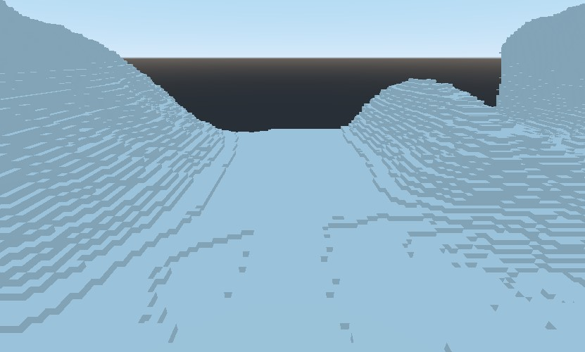

# Creating A Voxel Terrain
Now that your Godot Engine has voxel support built in, you can either download the [Voxel Game demo](https://github.com/Zylann/voxelgame) and start playing with it, or start creating your own terrain.

## Create A Terrain In The Editor 
1. Create a new project and a new 3D scene, with a Spatial type root node.
1. Add a Camera and elevate it by setting Transform Y = 75 and Rotation X = -25. The terrain starts generating around (0,0,0), but creates high hills, and may be invisible from underneath. We will be looking down from above.
1. Import a black and white heightmap texture such as [this one](https://github.com/Zylann/voxelgame/blob/master/project/blocky_terrain/noise_distorted.png) from the demo. Make sure that the file is imported as an Image and NOT a Texture on the Import panel. You'll likely have to re-import and restart.
1. Add a VoxelTerrain node and adjust the following settings:
	1. Provider: New VoxelStreamImage. Then click VoxelStreamImage again.
	1. Image: Load. Select your imported noise texture.
	1. Decide on the type of terrain you want:
		* Blocky: Set Channel = "Type" (or 0), and leave Smooth Meshing Enabled unchecked (lower down).
		* Smooth: Set Channel = "SDF" (or 1), and enable Smooth Meshing Enabled.
	1. Voxel Library: add a New VoxelLibrary
	1. Set the Viewer Path, Assign, select your camera or player (the parent of your camera).
1. Play your scene and you should see a terrain.




## Create A Terrain With Code

Add your own camera and environment as desired, or from above. Then drop this into a script:

```
const HEIGHT_MAP = preload("res://blocky_terrain/noise_distorted.png")

var terrain = VoxelTerrain.new()

func _ready():
	terrain.voxel_library = VoxelLibrary.new()
	terrain.stream = VoxelStreamImage.new()
	terrain.stream.image = HEIGHT_MAP
	terrain.view_distance = 256	
	terrain.viewer_path = "/root/Spatial/Player"	# Change to the path of your camera or player node
	add_child(terrain)				# Add the terrain to the tree so Godot will render it
```

---
* [Next Page](04_materials.md)
* [Doc Index](01_get-started.md)
