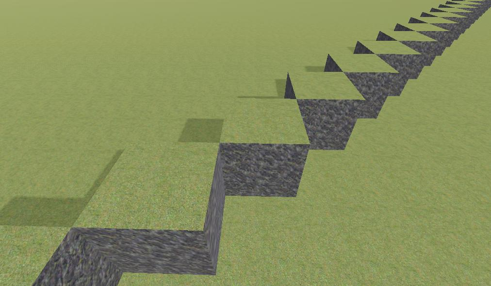

# Create Your Own Voxel Data Stream
You can provide your own stream of voxel data by extending VoxelStream either in GDScript or C++.

Note: Your stream must be thread safe.

Create MyStream.gd with the following contents:

```
extends VoxelStream
	
func emerge_block(buffer:VoxelBuffer, origin:Vector3, lod:int) -> void:
	if lod != 0: return
	if origin.y < 0: buffer.fill(1, 0)	
	if origin.x==origin.z and origin.y < 1: buffer.fill(1,0)
```

In your terrain generation script, add this:

```
const MyStream = preload ("MyStream.gd")
var terrain = VoxelTerrain.new()

func _ready():
	terrain.stream = MyStream.new()
	terrain.voxel_library = VoxelLibrary.new()	
	terrain.view_distance = 256	
	terrain.viewer_path = "/root/Spatial/Player"    # Set this path to your player/camera
	add_child(terrain)
```



`VoxelBuffer.fill()` is probably not what you want to use. Emerge_block generally gives you a block of 16x16x16 cubes to fill all at once, so you probably want to use `VoxelBuffer.set_voxel()` to specify each one. See the API here or in the editor for up to date function definitions.

You should review the [C++ code](../streams) for the built-in streams to see how they utilize the API to fill the buffers one voxel at a time.


---
* [Next Page](07_api-overview.md)
* [Doc Index](01_get-started.md)
