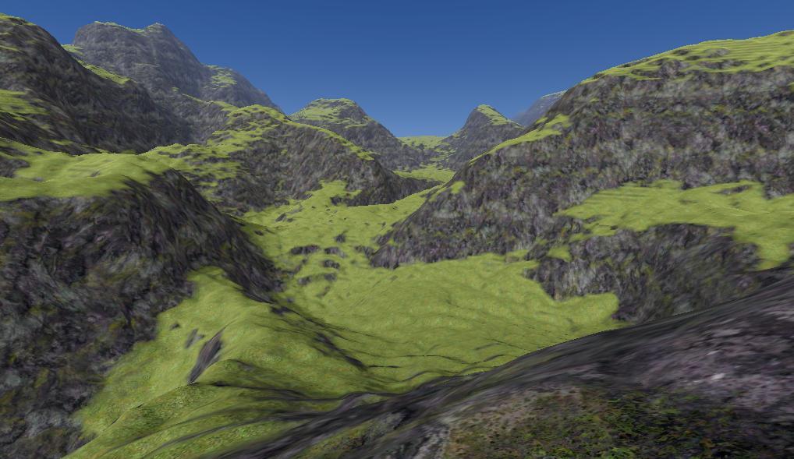

Smooth terrains
===================

It is possible to work with smooth-looking terrains, using signed distance fields and `VoxelMesherTransvoxel`.


Signed distance fields
-------------------------

TODO 


Transvoxel
-----------

TODO More information about Transvoxel

### Smooth stitches in vertex shader

Transvoxel uses special meshes to stitch blocks of different level of detail. However the seams may still be visible as occasional sharp little steps. To smooth this out a bit, meshes produced by `VoxelMesherTransvoxel` contain extra information in their `COLOR` attribute, telling how to move vertices to smooth those steps.

Create and setup a `ShaderMaterial` on your terrain, and integrate this snippet to it:

```glsl
uniform int u_transition_mask;

vec3 get_transvoxel_position(vec3 vertex_pos, vec4 vertex_col) {
	int border_mask = int(vertex_col.a);
	int cell_border_mask = border_mask & 63; // Which sides the cell is touching
	int vertex_border_mask = (border_mask >> 6) & 63; // Which sides the vertex is touching

	// If the vertex is near a side where there is a low-resolution neighbor,
	// move it to secondary position
	int m = u_transition_mask & (cell_border_mask & 63);
	float t = float(m != 0);

	// If the vertex lies on one or more sides, and at least one side has no low-resolution neighbor,
	// don't move the vertex.
	t *= float((vertex_border_mask & ~u_transition_mask) == 0);

	// Position to use when border mask matches
	vec3 secondary_position = vertex_col.rgb;
	return mix(vertex_pos, secondary_position, t);
}

void vertex() {
	VERTEX = get_transvoxel_position(VERTEX, COLOR);
    //...
}
```

Research issue which led to this code: [Issue #2](https://github.com/Zylann/godot_voxel/issues/2)


### Low-poly / hard-edged look

Use this in your fragment shader:

```glsl
NORMAL = normalize(cross(dFdx(VERTEX), dFdy(VERTEX)));
```


Texturing
-----------

At the moment smooth meshers don't provide UVs and texturing information, so this has to be done entirely using shaders. In the future it may be possible to convey information from generators or edited voxels to vertex attributes.

### Triplanar mapping

Applying a texture to a voxel terrain can be quite complicated if classic UV-mapping is used, because of the arbitrary shapes it can contain. So instead, we can use triplanar mapping.

The method involves projecting the texture on to the part of object that directly faces the X-axis. Then projecting it on the sides that directly face the Y-axis. Then again for the Z-axis. The edges of these projections are then blended together with a specified sharpness.

Look at how the brick textures are blended together on the top right sphere.


Read about [triplanar mapping in Godot](https://docs.godotengine.org/en/latest/tutorials/3d/spatial_material.html?highlight=triplanar%20#triplanar-mapping).

It is also possible to choose a different texture for the 3 axes.

Here's a shader that supports two materials, such as grass on the top and rock on the sides, each with triplanar mapped albedo, normal and AO maps, then blended together based on if their normal faces the upward direction or the sides.

You can find a working example in the [fps demo](https://github.com/tinmanjuggernaut/voxelgame), or see the [shader](https://github.com/tinmanjuggernaut/voxelgame/blob/master/project/fps_demo/materials/triplanar.shader) itself. 

In the shader parameters, add your two albedo maps, and optionally normal, and AO maps. Then play with the `AB Mix 1` and `AB Mix 2` sliders to adjust how the top and sides blend together. The other settings should be self explanatory. The screenshot below also has a little bit of fog and far DOF added.




### Recommended Reading

- [SpatialMaterial](https://docs.godotengine.org/en/stable/classes/class_spatialmaterial.html) - demonstrates many of the shader options available in Godot.
- [Shading Index](https://docs.godotengine.org/en/stable/tutorials/shading/index.html) - tutorials and the shader language API
- Shader API Reference - some of the most frequently accessed references
	- [Shading Language](https://docs.godotengine.org/en/stable/tutorials/shading/shading_reference/shading_language.html)
	- [SpatialShader](https://docs.godotengine.org/en/stable/tutorials/shading/shading_reference/spatial_shader.html)


